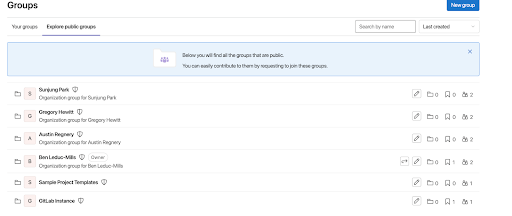
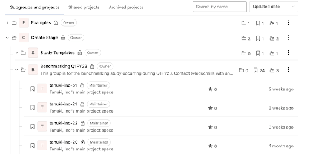
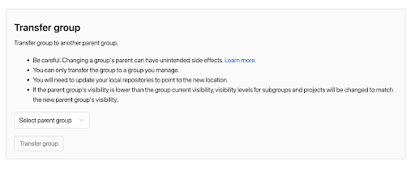

## Testing environment for UX research studies

The User Experience (UX) team has developed resources for usability and workflow testing using a ‘sandbox’ area provisioned by the Infrastructure team. This allows for tightly controlled testing on a real GitLab instance without the risk of critical data loss or a security breach to gitlab.com. This page details the steps needed to access the sandbox and guidelines on how to structure a study within the sandbox.

## What’s a UX Cloud Sandbox?

The UX Cloud Sandbox is a reserved instance of GitLab running in its own ‘private’ space. Essentially, it acts as a completely separate installation of GitLab, similar to that of a self-managed client. That space is currently at [https://ux.gitlabdemo.cloud/](https://ux.gitlabdemo.cloud/).

The UX team uses this space for usability testing, workflow studies, and usability benchmarking. The sandbox solves two problems: 1) it creates a safe environment for external participants to be able to share their screens without violating security or privacy concerns, and 2) it allows us to test Admin and Ultimate plan features not easily accessible through gitlab.com.

You may wish to use the UX Cloud Sandbox if you are interested in:

- Evaluating current workflows, JTBD, user journey maps, and so on…
- Conducting user studies that require Admin privileges, Ultimate plan features, or more complex functionality (CI/CD pipelines, threat monitoring, and so on)
- Conducting studies geared towards self-managed users
- Performing [Category Maturity Scorecard](/handbook/product/ux/category-maturity/category-maturity-scorecards/) studies
- Performing [usability benchmarking](/handbook/product/ux/ux-research/usability-benchmarking/) studies
- [Validating solutions](/handbook/product/ux/ux-research/solution-validation-and-methods/) that have already been released into the product
- Running [problem validation studies](/handbook/product/ux/ux-research/problem-validation-and-methods/)


### Access to the UX Cloud Sandbox

To gain access to the UX Cloud Sandbox, the first step is to generate credentials. You can self-serve on that by [following the steps on this handbook page](/handbook/customer-success/demo-systems/#access-shared-omnibus-instances) under ‘Access Shared Omnibus Instances’.

Once you have generated credentials and accessed [the sandbox instance](https://ux.gitlabdemo.cloud/), you will be automatically granted your own group space with your name on it (see picture below). This group is like any other group in GitLab, it just has your name on it, and will act as the container for all of the work you do in the sandbox.



### Structuring your study

**Again, everything you do should be within your own group.** Your group will have your name on it, and it lives at the ‘root’ of all of your work. To preserve this structure, please try to avoid creating any other top-level group (at the same level as the group with your name) on the shared instance.

Within your group, you can structure sub-groups and projects however you see fit. One good way to think about it is as a file system: groups are ‘folders’ and projects are ‘files’. Your structure may end up looking something like this:



If you find that you need to make adjustments to the group/subgroup structure, you can move subgroups around by following these steps:

1. Go to the group page you wish to change.
1. Go to **Settings** -> **General**
1. Under the **Advanced** section, find **Transfer group**
1. Use the **Select parent group** dropdown to find the parent group where you want this group to live
1. Click **Transfer group**
1. The group you edited should now be a subgroup of the folder/parent group you selected in the dropdown. (Note: this is recursive, so anything under the group you move also moves)



## Creating a project with sample data

There are several reasons you might wish to generate sample data within your group or projects. These projects are empty by default, and testing user behavior on an empty project is not very accurate or realistic. It can be time consuming and tedious to handcraft an entire project’s worth of sample data, so we’ve created a few options to populate your projects with sample data through Ruby scripts.

**Note:** Not every type of data can be generated, especially in more complex setups. To get an idea of what is and isn’t possible, check the [GitLab Ruby gem documentation](https://www.rubydoc.info/gems/gitlab/Gitlab/Client).

For questions or troubleshooting, reach out to @leducmills on Slack.

#### Option 1: If you have the GDK and are comfortable with some light code editing

Note: It is easier to create a project and populate it with sample data than to populate an already existing project. However, you can edit the sample data ruby scripts (linked below), if you feel comfortable.

1. Go to the [sample data scripts repository](https://gitlab.com/leducmills/uxr-dummy-data-scripts/-/tree/master). This project has several ruby scripts that show how different types of data might be populated. Request access if needed.
1. Clone it locally to your machine (not in your GDK directory).
1. If you don’t have it installed already, install the [‘Faker’ Ruby gem](https://rubygems.org/gems/faker).
 `$ gem install gitlab faker`
1. From your local GDK instance, create an access token with API scope (if you don’t have one already).
1. Look through the different Ruby scripts, and copy the one that most closely matches your use case to a new file.
1. Add your local endpoint and access token at the top of the script:

```ruby
#this sets up our connection to our gitlab instance
client = Gitlab.client(
    endpoint: 'Add the endpoint URL here',
    private_token: 'Add your token here'
)
```

1. Find the section in your Ruby file called `# Global Variables for instance setup` (probably around line 95 or so)
1. Change the variables to meet your requirements (for example, how many issues, labels, branches, etc. you want)
1. From your terminal, run your file: `ruby your_file_name.rb`. You will see a number of status messages print to the terminal informing you of the status. Once the script stops, the data creation is complete.
1. Check the result on your local instance. If you are happy with the result, go to **Settings**, and export the project.
1. Back in the UX Cloud Sandbox, create a new project in the directory for your project, select **Import project** from the options, and then select the exported file from your local project.
1. Check the uploaded project to ensure that the data you expect to be there is present and correct. Reminder: not all data gets exported.

If everything has worked properly, you should see your imported project, with all of the sample data intact, within the sandbox.

**Important:** Forking a project is the quickest way to copy a project to a new space (or create your ‘session’ projects). However, it does not copy over data like merge requests, labels, or issues. It does copy branches, commits, files, and commit messages, though, so if that’s all you need, fork away.

If you do need MR, issue, and label data, you must repeat the import process for each session you wish to run by creating a new project, selecting import, importing from gitlab export, and selecting your .tar.gz file for each upload.

#### Option 2: Create a sample data request

If you would like a project (or projects) with sample data to be created for you, please create a new [UX Research issue](https://gitlab.com/gitlab-org/ux-research/-/issues/new#) using the 'Sample Data Request' template. **Note: It is easier for the team if you do not create your project before opening the issue, as it is easier to create and populate the project at the same time.**

The following information is required to fulfill a request to create these projects:

- Group and study name (for example, Q1FY23 Create Stage Benchmarking)
- Dates your study will run
- Number of projects and sub-groups you need
- How many of the following you would like in your project(s):
    - Labels
    - Milestones
    - Issues
    - Branches
    - Files
    - Merge requests (limit 1 per branch)
- Any specific names or values for the above data types (for example, a branch named 'staging')
- Feature flags you need enabled (note that only those which have been release into production are available)

Example defaults for the various content types can be found in [this sample project](https://gitlab.com/ux-research-sandbox/examples/tanuki-inc-example-1).

Please note, the following items are NOT exported when a test project is created and imported into the research sandbox:

- Job logs and artifacts
- Container registry images
- CI variables
- Pipeline triggers
- Webhooks
- Any encrypted tokens

While you **can** create users and user credentials through the scripts, it is generally discouraged, as we do not want the sandbox to be bloated with fake user accounts. Luckily, the UX Research team has a set of user accounts specifically for testing that you can use.

#### Accessing Test User Accounts

Once you are logged into the sandbox, navigate to a group called `User Test Accounts`. There is a project in that group named `testing accounts`. On the main branch of this project is a file called  `accounts.md`. This file contains the credentials for all the user test accounts, as well as instructions on how to create more accounts if needed.

When using test accounts for your study **you will be responsible for changing the password after each participant session to protect our environment.** The last updated password (after your final user) will need to be recorded in the `accounts.md` file for the next person to use.

## Dos and don'ts

Do:

- Keep the space organized according to the guidelines laid out in the [Structuring your Study](#structuring-your-study) section. This means putting your studies in the correct location with appropriate naming conventions.
- Clean up your mess. Delete studies and projects that are not going to be used, were created incorrectly, are outdated, and so on.
- Remember to change passwords for the test accounts you’re working with after every participant. This is critical for maintaining the safety and accuracy of the data on the sandbox.

Don't:

- Mess with any projects, studies, or settings, unless you are absolutely sure you know what you’re doing. If you have any doubts, please post to the [ux_research Slack channel](https://gitlab.slack.com/archives/CMEERUCE4), or contact @leducmills directly on Slack.
- Clean up other peoples’ messes. Don’t delete or move other projects, unless you know for sure that no one is currently using them or will need to access them in the future.

## FAQ

**Q: How do you change the user password in the UX sandbox so that you can use a different password for each participant in a usability study?**

A: Follow the steps on how to change the passwords on user profiles outlined in this [video](https://youtu.be/yul5yDoEAKE)

**Q: Is it possible to use the UX sandbox for unmoderated usability tests? If so, how?**

A: Yes! Once you have a sample project and a test account with the correct permissions set up, you can use UserTesting to run each test 1 by 1. Make sure to include login credentials for users and the link to the UX sandbox environment. Once the test is complete, make any updates necessary for the test project, update the password for the test user, and finally, update the login credentials in the test script. Continue following those steps until you reach the target number of participants for your study.
