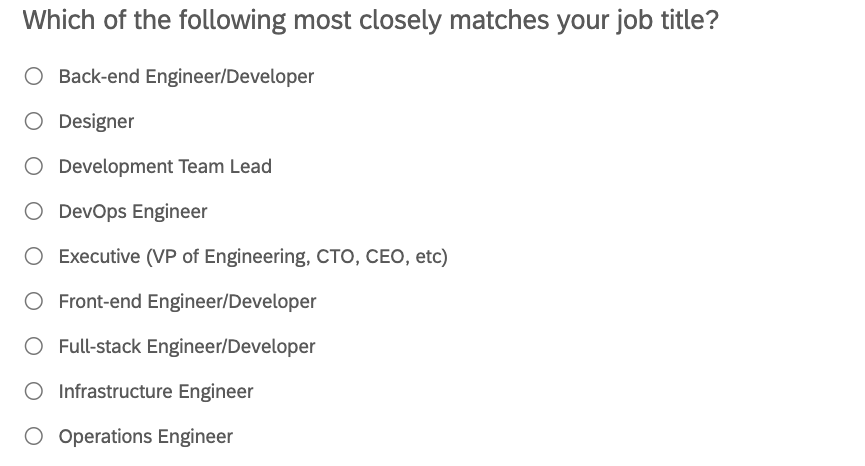
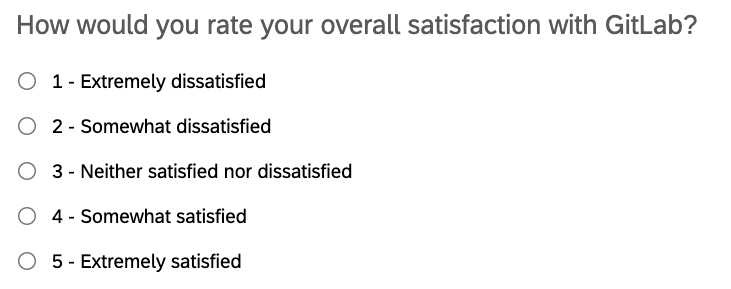
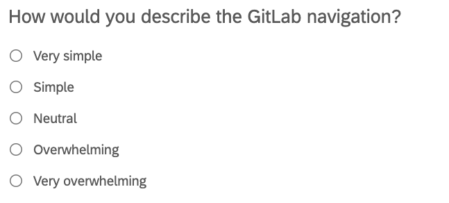
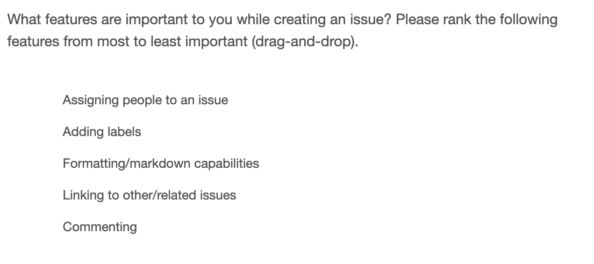

There are many types of survey questions to choose from when designing your survey.  Determining which kind of survey question to choose to use depends on the data you need to collect. Below are some of the more common survey question types that we use at GitLab.

- **Open ended** - Typically a comment box or a single line where respondents can type in responses.
     - Best for: qualitative data such as providing feedback
     - Things to watch for: don’t use too many of these types of questions, time-consuming to analyze, participants tend to skip them and/or leave limited detail

     

- **Multiple choice** - Offers respondents one or more options to choose from. Intuitive for respondents to complete. Can also be used with images as choices.
     - Best for: you have informed data to support the options, the options are distinct
     - Things to watch for: offering too many choices

     

- **Rating scale** - Allows the respondent to select a number as their response.
     - Best for: research questions that require numerical measures as data (example: scores, ratings, etc.)
     - Things to watch for: the scale needs to be defined (example: if the scale is ‘1-5’…define what 1 and 5 mean)

     

- [**Likert scale**](https://www.nngroup.com/articles/rating-scales/) - A type of a rating scale question that lets respondents choose words/phrases that align with their feelings.
     - Best for: measuring feelings, attitudes, or opinions
     - Things to watch for: the scale needs to be balanced (has an equal number of positive and negative items)

     

- **Matrix** - A set of questions that all have the same scale and are presented as a grid.  Often used in conjunction with Rating scale or Likert scale questions.
     - Best for: consolidating questions that have the same scale into an efficient experience
     - Things to watch for: presenting too many questions in the matrix, keeping the scale the same, making sure the questions are clear and related

     

- **Ranking** - Allows respondents to rank a list of items, typically by preference.
     - Best for: understanding how users rank certain items in relation to other items (example: ranking possible features to build)
     - Things to watch for: offering too many items to rank (very common) which can impact how much time it takes respondents to rank items, making sure respondents understand each item clearly (can be accomplished by [piloting the survey first](/handbook/product/ux/ux-research/surveys/piloting-your-survey/).

     

### Survey question examples

| **Question type** | **Goal of this sample question**                            | **Poor wording version**                                                        | **Problem with the wording**                                            | **Better wording version**                                                                                                           |
|-------------------|-------------------------------------------------------------|---------------------------------------------------------------------------------|-------------------------------------------------------------------------|--------------------------------------------------------------------------------------------------------------------------------------|
| Open-ended        | Acquire feedback on the GitLab experience                   | *“How great is the GitLab experience?”*                                         | Positively biased                                                       | *“Tell us about your experience using GitLab.”*                                                                                      |
| Multiple choice   | Understanding how many hours respondents use GitLab per day | *“How many hours do you use GitLab per day?” (1-2 \| 2-3 \| 3-4 \| 4-5 \| 5-6)* | Overlapping options, lack of scoped timeframe, no option for ‘other___’ | *“Within the last week, how many hours have you used GitLab per day?” (1-2 \| 3-4 \| 5-6 \| Other:*__)_                              |
| Rating scale      | Net Promoter Score                                          | *“How likely are you to recommend GitLab…” (0-10)*                              | Scale is not defined                                                    | *“How likely are you to recommend GitLab…” (0 (not likely) -10 (very likely))*                                                       |
| Likert scale      | Understand satisfaction of the GitLab experience            | *“How was your GitLab experience?” (Awesome \| Amazing \| Great \| Good \| OK)* | Unbalanced scale                                                        | *“How satisfied were you with the GitLab experience?” (Very dissatisfied \| Dissatisfied \| Neutral \| Satisfied \| Very satisfied)* |
